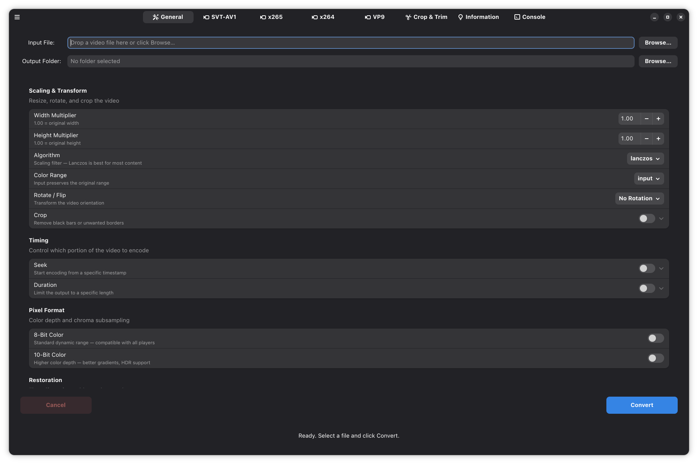

# FFmpeg Converter GTK

**Modern GTK4 + libadwaita frontend for FFmpeg**

My own pet project. FFmpeg-Converter-GTK a simple GTK / Libadwaita frontend for FFmpeg. Currently supports encoding with AV1, x265. Slowly but surely adding more features and refinement.



### Features

- Dedicated tabs for **SVT-AV1** and **x265** with deep encoder control
- Automatic crop detection, HDR to SDR tone mapping, scaling, rotation, speed control, and more
- Smart audio settings (Opus, AAC, MP3, FLAC, normalization, speed adjustment)
- Live console output and detailed information tab
- Native Adwaita UI

### Build & Install

```bash
git clone https://github.com/orlfman/FFmpeg-Converter-GTK.git
cd FFmpeg-Converter-GTK
chmod +x build.sh
./build.sh
